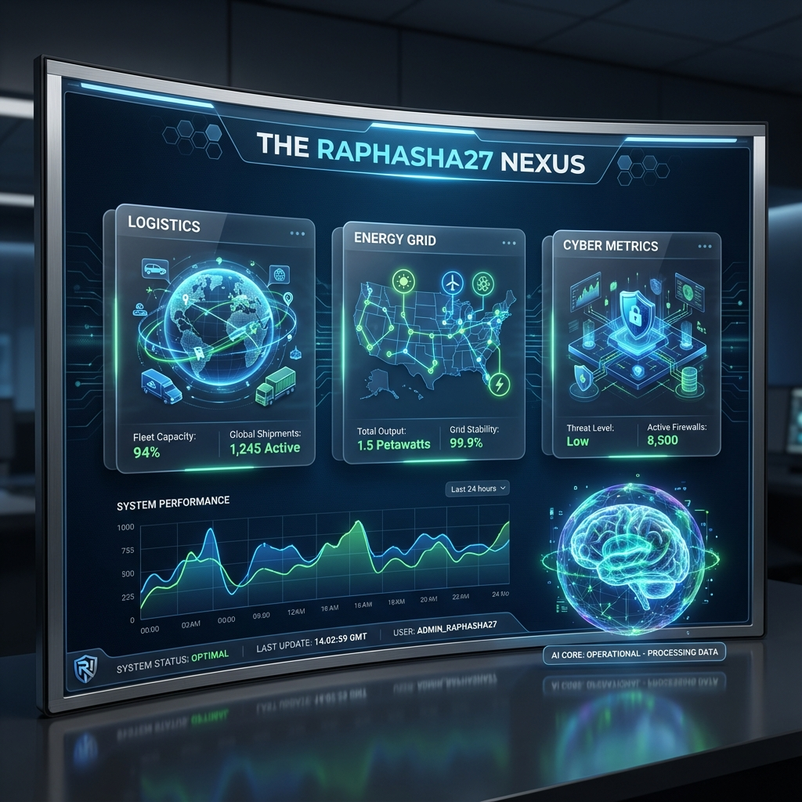
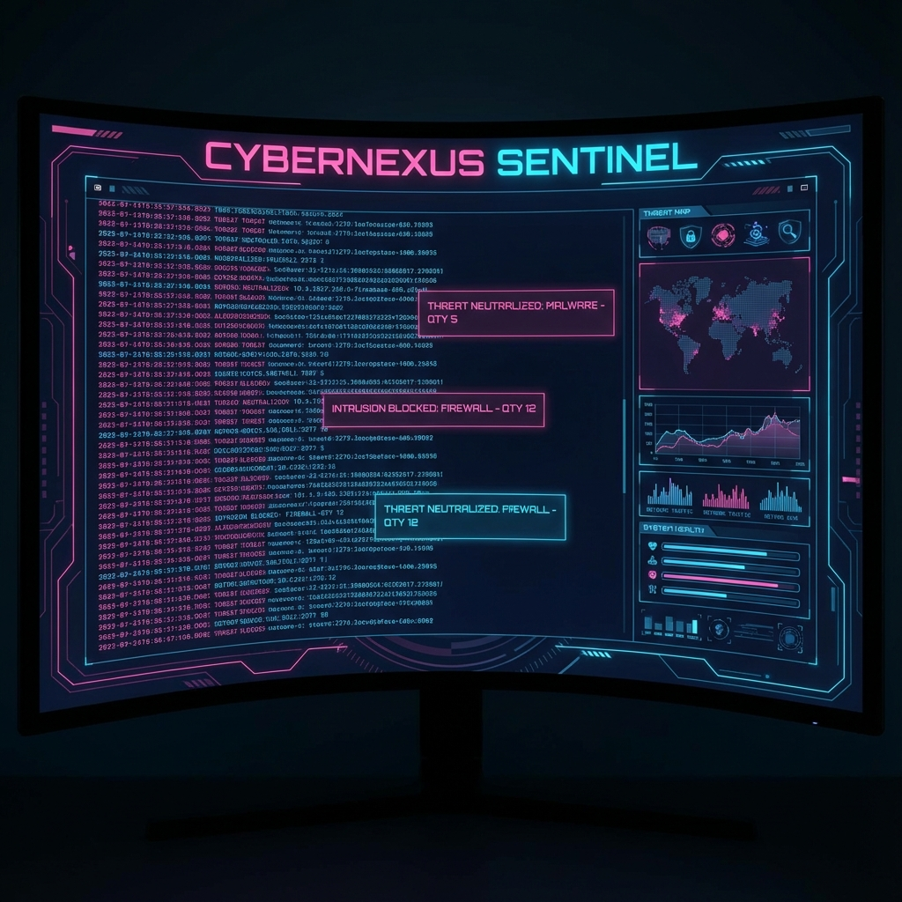
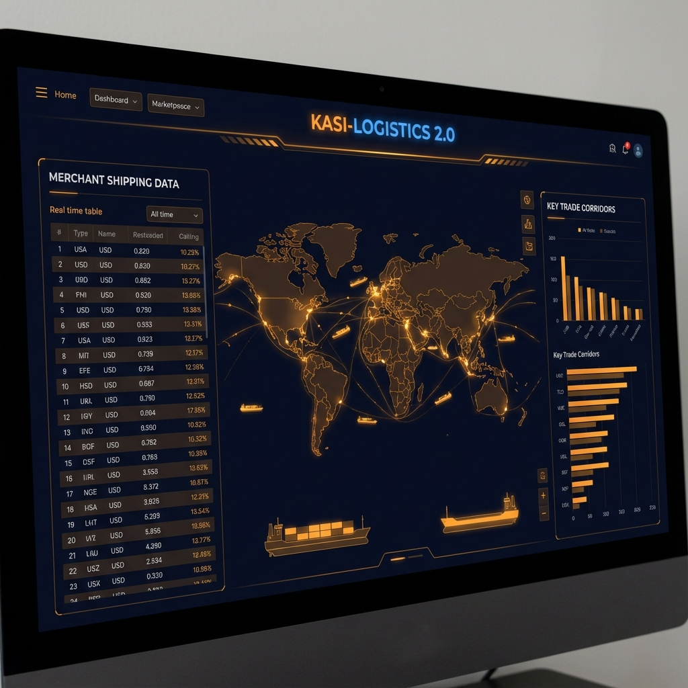

# 👑 THE RAPHASHA27 AI SOVEREIGN NEXUS (v2.0 - GLOBAL MODE)

> **"Sovereign Intelligence for a Integrated Future."**

## 🖼️ Visual Showcase

### Master Command Center (Global Mode)


### CyberNexus Sentinel SOC


### Kasi-Logistics 2.0 Bridge


---
Welcome to the **Raphasha27 AI Sovereign Nexus**, a decentralized, agentic AI ecosystem designed to manage and protect the critical infrastructure and socio-economic vitals of South Africa. Built with a 7-pillar architecture, this system integrates localized AI responses with global standards and Gemini-powered strategic reasoning.

---

## 🌌 The 7-Pillar Architecture

The Nexus is divided into seven autonomous yet synchronized pillars, each with its own **FastAPI backend** and **Vite/React frontend**.

1.  **🌍 EcoArbitrage AI (Social Harmony)**: Bridges socio-economic fairness with UNESCO/WHO standards.
2.  **📦 Kasi-Logistics 2.0 (Global Trade)**: Connects township merchants directly to international ports (Rotterdam, Dubai) via neural trade corridors.
3.  **🛡️ CyberNexus Sentinel (Cyber Fortress)**: A Zero-Trust infrastructure shield with autonomous threat neutralization.
4.  **☀️ SolarGrid Sentinel (Energy Sovereignty)**: Manages decentralized energy consensus and protects against grid collapse.
5.  **🌽 Agri-Nexus AI (Food Security)**: Optimizes harvest yields and eliminates market middleman exploitation.
6.  **🏥 HealthNexus AI (Predictive Wellness)**: Outbreak suppression and community health vitals synced with WHO.
7.  **💧 AquaNexus AI (Water Sovereignty)**: Protects dams, detects municipal leaks, and ensures neurally-filtered water quality.

---

## 🧠 The Sovereign Brain (Central Intelligence)

The **Master Command Center** features the "Sovereign Brain"—a strategic advisor powered by **Google Gemini 1.5 Flash**. 

-   **Aggregated Analysis**: The Brain polls all 7 pillars in real-time.
    -   **Cross-Sector Reasoning**: It analyzes how a failure in one sector (e.g., Energy) affects others (e.g., Logistics or Health).
    -   **Crisis Mode**: If a critical failure is detected (like a total grid collapse), the entire HUD enters **Red Alert Mode**, and the AI forces open a strategic intervention plan.

---

## 🛠️ Technology Stack

-   **Backend**: Python, FastAPI, Pydantic, Uvicorn, Google Generative AI (Gemini), HTTPX.
-   **Frontend**: React, Vite, Vanilla CSS (Premium Glassmorphism), Lucide React.
-   **Orchestration**: Python-based Master Run script for simultaneous 16-process management.

---

## 🚦 Installation & Launch

### 1. Set up Environment
Ensure you have Python and Node.js installed.
Create a `.env` file in `MasterCommandCenter/backend/`:
```env
GEMINI_API_KEY=your_key_here
```

### 2. Launch the System
Run the master orchestrator from the root directory:
```bash
python master_run.py
```

### 3. Access the Dashboards
-   **Master Command Center**: [http://localhost:5180](http://localhost:5180)
-   *All individual pillars are accessible via the Master HUD.*

---

## 🗺️ Project Topology

| Component | Port (Frontend) | Port (Backend) |
| :--- | :--- | :--- |
| **MASTER HUB** | **5180** | **8007** |
| EcoArbitrage | 5173 | 8000 |
| Kasi-Logistics | 5174 | 8001 |
| CyberNexus | 5175 | 8002 |
| SolarGrid | 5176 | 8003 |
| Agri-Nexus | 5177 | 8004 |
| HealthNexus | 5178 | 8005 |
| AquaNexus | 5179 | 8006 |

---

## 🚀 Future Roadmap
- [ ] Integration with real-time satellite telemetry.
- [ ] Blockchain-based trade ledger for Kasi-Logistics.
- [ ] Neural voice-command HUD for the Sovereign Brain.

**Developed by Antigravity for Raphasha27 - Global Mode 2026.**
